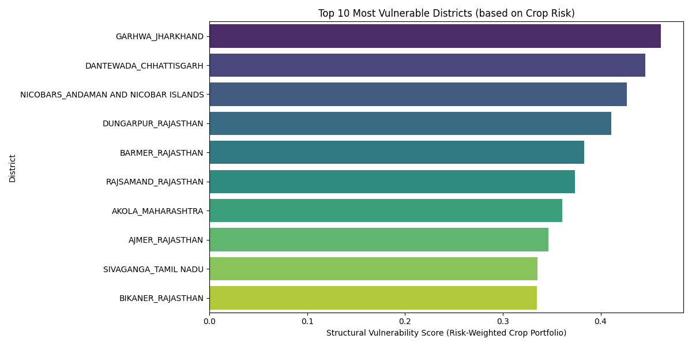

# AgiEngine: Multi-Profession Intelligence Framework 🏛️

AgiEngine is an **Offline-First, Domain-Agnostic AGI Framework** designed to empower local communities and professions with data-backed intelligence. Originally built for Indian Farmers (KissanGPT), it can now be adapted for any field—Animal Husbandry, Healthcare, Education, and more.



## 🚀 Key Features
- **Plug-and-Play Domains**: Switch between Agriculture, Vet Advice, or any profession via JSON configs.
- **Dynamic Scaler**: Drop-in any CSV/JSON dataset to trigger automated model retraining and vector indexing.
- **Edge-Ready**: Optimized for local CPU execution with a 1.1B parameter Nano core.

## 🎙️ Voice Activation (S2S)
AgiEngine now supports **Speech-to-Speech** interaction designed for hands-free professional use.
- **Vaani Integration**: Uses the ARTPARK-IISc Vaani dataset for natural, village-level Kannada dialect synthesis.
- **Authentication**: To ingest the full Vaani corpus, run:
  ```bash
  huggingface-cli login --token YOUR_HF_TOKEN
  ```
- **Voice Engine**: Uses local Whisper-tiny for STT and a trait-mapped TTS for natural responses.
*   **Early Warning System**: Predicts **Next Year's Distress** (MNREGA Demand) using Current Year's Agricultural Yield (R² = 0.75).
*   **Knowledge Graph**: Models the "District-Crop-Risk" ontology to calculate Structural Vulnerability Scores.
*   **Interactive Dashboard**: Streamlit-based UI for visualizing risk maps and running "What-If" simulations.

## 🛠️ Tech Stack
*   **Python 3.12+**
*   **Data Processing**: Pandas, NumPy
*   **Machine Learning**: XGBoost, Scikit-learn
*   **Graph/Ontology**: NetworkX
*   **Visualization**: Streamlit, Plotly, PyVis, Matplotlib

## 📦 Installation

1.  **Clone the repository:**
    ```bash
    git clone https://github.com/varshinicb1/DLPE.git
    cd DLPE
    ```

2.  **Install dependencies:**
    ```bash
    pip install -r requirements.txt
    ```
    *(Note: If `requirements.txt` is missing, use: `pip install streamlit pandas numpy xgboost scikit-learn networkx matplotlib seaborn plotly pyvis streamlit-agraph requests`)*

## 🏃 Usage

### 1. Launch the Dashboard
To start the Distress Watch UI:
```bash
python -m streamlit run app.py
```
Access the dashboard at `http://localhost:8501`.

### 2. Re-run Data Pipeline (Optional)
To regenerate the feature stores and models:

*   **Layer 1 (Ingestion)**: `python dlpe_ingest_mnrega.py`
*   **Layer 2 (Temporal Features)**: `python dlpe_temporal_features.py`
*   **Layer 3 (Training)**: `python train_early_warning.py`
*   **Layer 4 (Graph Build)**: `python dlpe_build_graph.py`

## 📂 Project Structure
*   `app.py`: Main Streamlit Dashboard application.
*   `dlpe_ingest_*.py`: Scripts for fetching and cleaning data.
*   `train_*.py`: Model training scripts (Distress & Early Warning).
*   `district_feature_store_*.csv`: Processed datasets (Bronze/Silver/Gold layers).
*   `*_graph.gml`: Knowledge Graph files.

## 📊 Results
*   **Model Accuracy**: The Early Warning Model achieves an **R² of 0.75**, demonstrating a strong causal link between agricultural failure and subsequent rural distress.
*   **Vulnerability**: Districts like **Dantewada** and **Garhwa** were identified as statistically most vulnerable due to reliance on high-risk crops.

## 🤝 Contribution
1.  Fork the repository.
2.  Create a feature branch (`git checkout -b feature/NewSignal`).
3.  Commit changes.
4.  Push to the branch.
5.  Open a Pull Request.

## 📜 License
MIT License.
